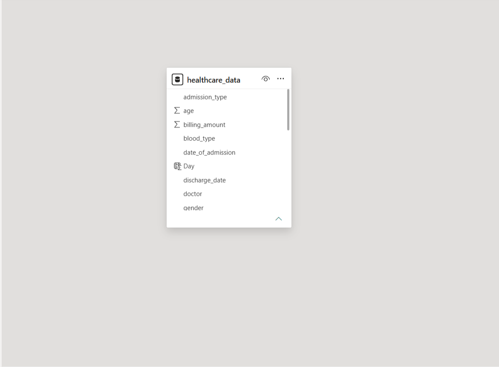
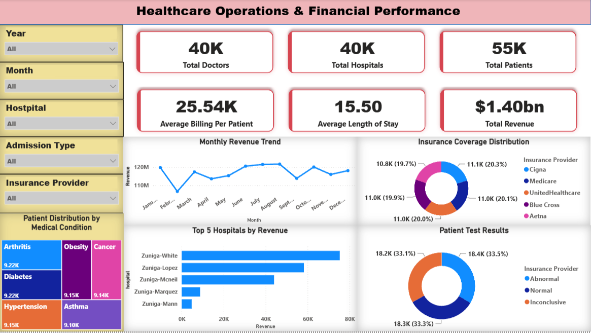

# Healthcare Operations & Financial Performance

End-to-end healthcare analytics project: SQL Server → Python (EDA + statistical testing) → Power BI dashboard, covering 54,966 hospital admission records.

## The Business Problem

Hospital management needs a single, data-driven view of who they treat, what it costs, and where operational risk sits — which age groups drive care volume, which conditions and hospitals drive cost, whether admission type or gender meaningfully affect billing and length of stay, and where the underlying data itself has quality problems that would undermine that reporting.

Full statement: [`05_Documentation/Business_Problem.md`](./05_Documentation/Business_Problem.md)

## What's in this repo

```
├── 01_Dataset/
│   └── healthcare_dataset.csv                       (54,966 admission records after cleaning)
│
├── 02_SQL/
│   └── Healthcare_analysis.sql                      (28 business questions — demographics,
│                                                       revenue, hospitals, doctors, insurance)
│
├── 03_Python/
│   ├── Exploratory_Data_Analysis.ipynb               (cleaning: dedup, casing, load to SQL Server)
│   └── Statistical_Analysis.ipynb                    (descriptive stats, correlation,
│                                                       hypothesis testing)
│
├── 04_PowerBI/
│   ├── Healthcare_Operations___Financial_Performance.pbix   (1-page executive dashboard)
│   ├── dashboard.png
│   └── data_model.png
│
├── 05_Documentation/
│   ├── Business_Problem.md
│   ├── KPI_Definitions.md
│   └── Healthcare_Business_Conclusion_Report.pdf     (full findings, methodology, caveats)
│
├── LICENSE
└── README.md
```

## Data Model



Single-table model: `healthcare_data` (patient, admission, billing, and clinical fields) loaded into SQL Server after Python cleaning, then imported directly into Power BI.

## Dashboard

**Healthcare Operations & Financial Performance** — one page, filterable by year, month, hospital, admission type, and insurance provider. Shows total doctors/hospitals/patients, average billing per patient, average length of stay, total revenue, monthly revenue trend, top 5 hospitals by revenue, insurance coverage split, and test result split.



## Key Findings

- **$1.40bn** total billing across **54,966** admission records (55,500 raw rows, 534 duplicates removed), averaging **$25,544** per patient and **15.5 days** per stay.
- **No meaningful correlation** between age, billing amount, and length of stay (r ≈ 0.00–0.01).
- **No significant difference** in billing between Emergency and Elective admissions (t-test, p = 0.47), and **no significant difference** in length of stay across admission types (ANOVA, p = 0.135).
- Gender and admission type show a statistically significant association (χ², p = 0.007), but the effect size is small enough (<3% gap between groups) to be practically negligible.
- Hospital, doctor, insurer, and test-result distributions are all close to uniform, and 39,876 of 54,966 rows have a unique hospital name — evidence this dataset is synthetic rather than real operational history, so hospital/doctor "leaderboards" should be read as illustrative, not as real business signal.
- 106 records carry negative billing amounts (down to -$2,008), flagged as a data-quality issue to resolve before this pipeline is used on real financial data.

KPI formulas: [`05_Documentation/KPI_Definitions.md`](./05_Documentation/KPI_Definitions.md)
Full detail, methodology, and caveats: [`05_Documentation/Healthcare_Business_Conclusion_Report.pdf`](./05_Documentation/Healthcare_Business_Conclusion_Report.pdf)

## Tech Stack

SQL Server · Python (pandas, seaborn, matplotlib, scipy) · Power BI · Jupyter
